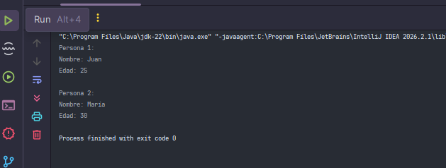

Ejercicio 1 - Persona

En este ejercicio se creó una clase Persona con los atributos nombre y edad.

Se creó una clase Main con el método main, donde se instanciaron dos objetos de la clase Persona utilizando new. 
Luego, se asignaron valores directamente a sus atributos y se mostraron sus datos por consola mediante el operador.
## Conceptos practicados

- Creación de clases.
- Atributos de instancia.
- Creación de objetos.
- Instanciación mediante `new`.
- Acceso a atributos mediante el operador `.`.

## Captura de ejecucion
